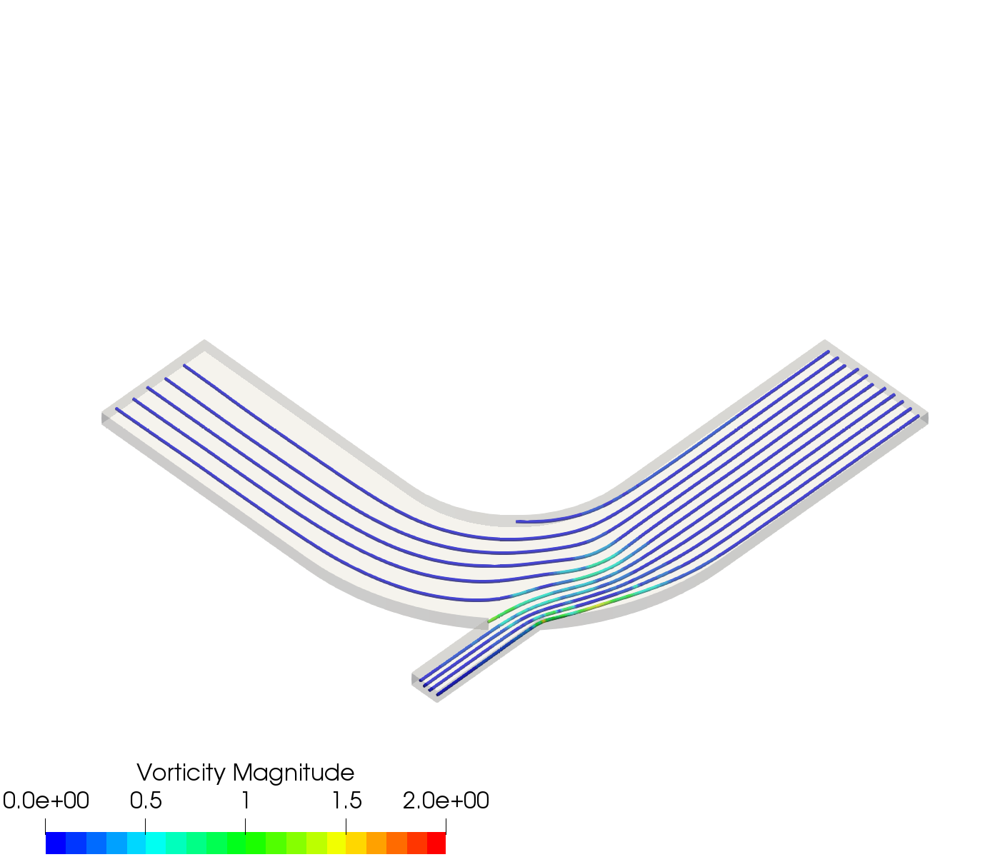
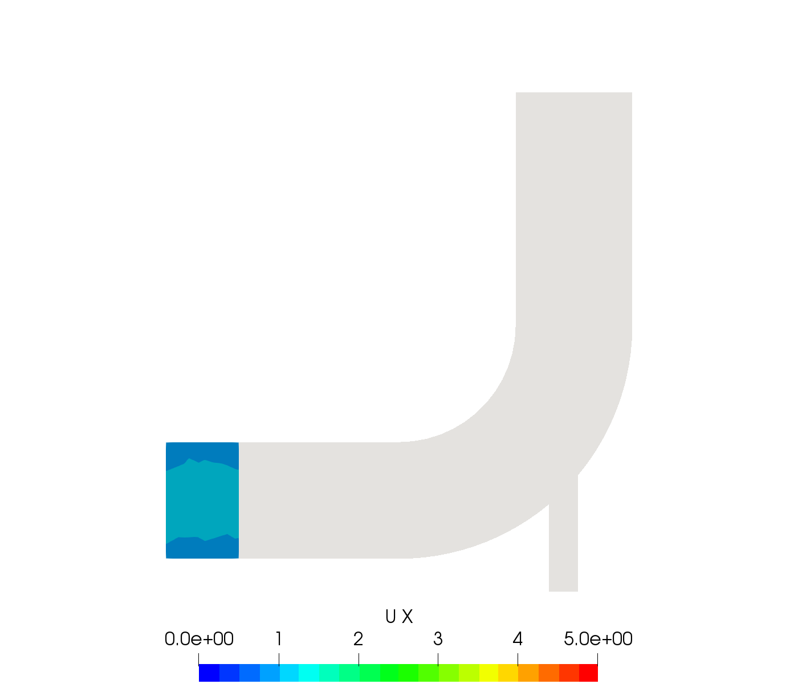
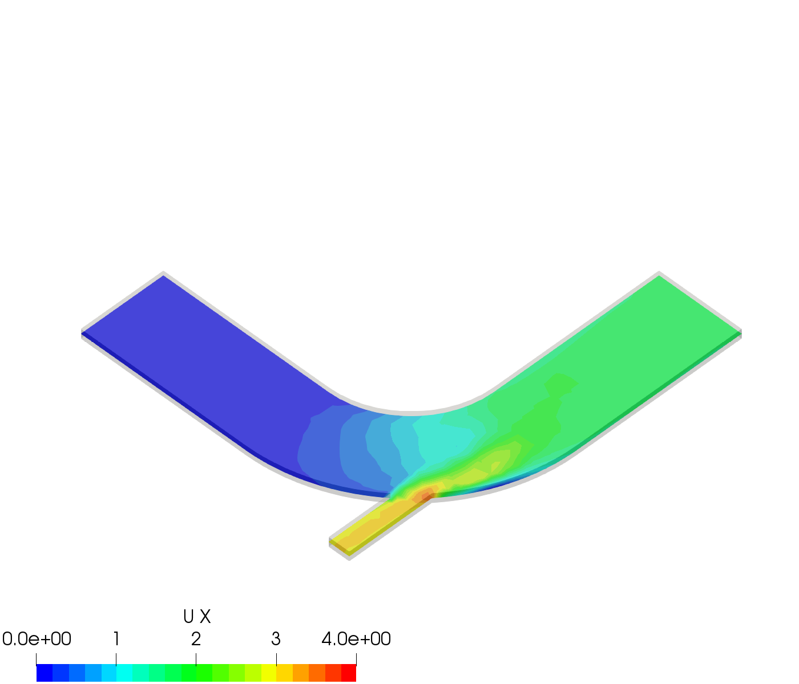
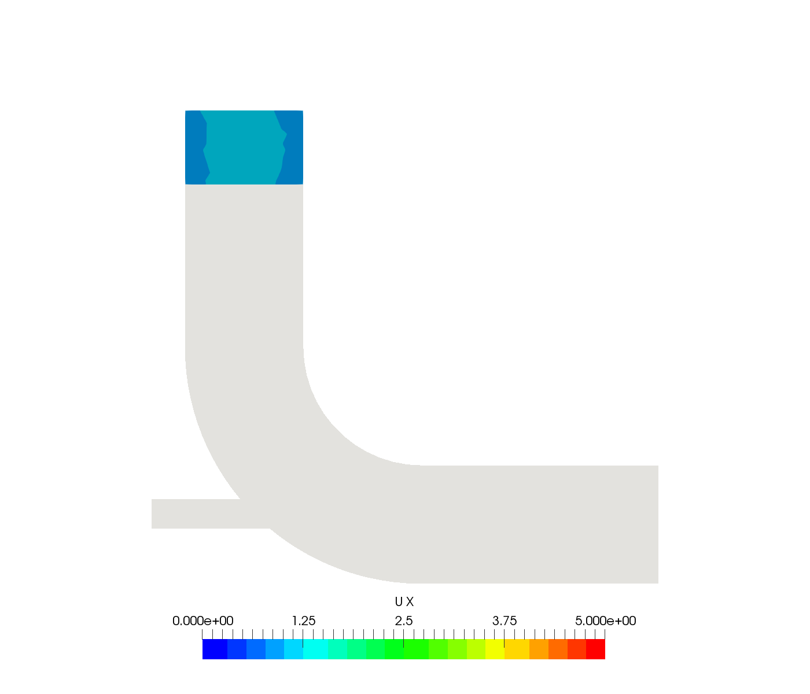
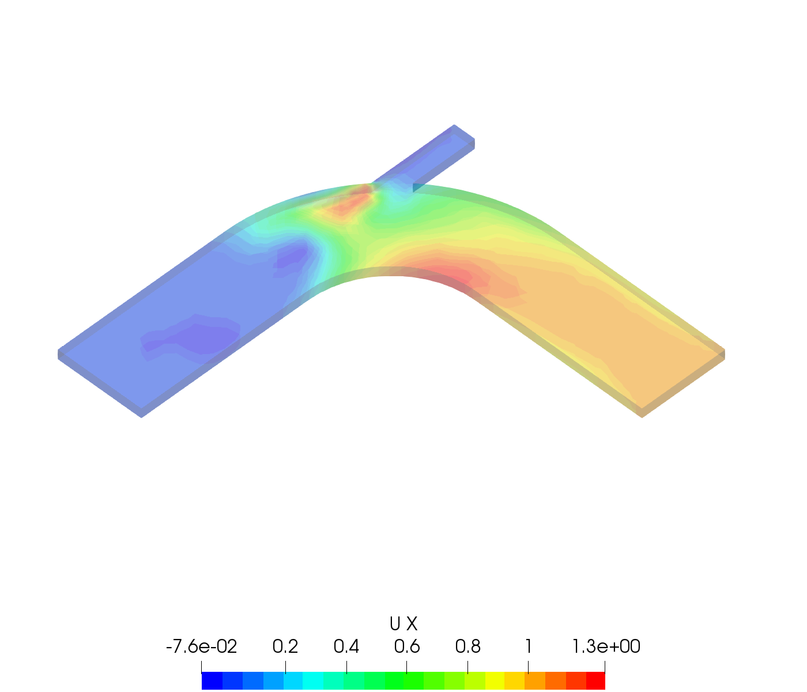

Metric Extraction
-----------------

The below describes a json file syntax created to extract field information from simulation domains. It uses the ParaView Python API to extract these metrics in the form of Probes, Lines, Slices, Clips and Volumes.

The below parameters need to be specified for each of the desired metrics:

-   **name**: Unique metric name
-   **field**: Domain field to extract metrics from (must be available in the model). **For `Basic` metric type, specifying `field` is optional (see below)**
-   **fieldComponent**: For vector/tensor quantities specify the desired component as fieldComponent. If `fieldComponent` is not given for vector/tensor quantities, the magnitude of the desired quantity will be extracted, i.e., the default is "fieldComponent": "Magnitude"
-   **type**: Specifies the type of metric. The types are "Basic", "Clip", "Line", "Probe", "Slice", "Volume", "StreamLines", and "FindData". Additional fields for each metric type are listed below.
-   **position**: See below type definition for position description
-   **extractStats**: Set to "false" if quantitative metrics to the csv file (ave,min,max,sd) is not needed (default: "true"). **Note** `extractStats` is set to `false` for `WarpByVector` type.
-   **extractStatsTimeSteps**: Defines the simulation steps at which the metrics/statistics are extracted. The steps can be set as follows:
    -   "last": (**default**) The metrics from the last time step of the simulation are extracted
    -   "all" : The metrics from every simulation time point are extracted
    -   "first": The metrics from the first time step of the simulation are extracted
    -   Multiple time points can be specified in two ways:
        1.  Multiple values delimited by ",".
        2.  Entering a range of integers by following the *<https://docs.python.org/2/library/functions.html?highlight=slice#slice>* For example

            ``` example
            "1:3"        # extracts at steps starting from 1 through 3
            "4:"         # extracts at steps start from 4 to the end
            ":5"         # extracts at steps start from the beginning through 4
            ":"          # extracts at all steps
            "1:20:5"     # extracts at steps starting from 1 through not past 20, by step 5
            "-2:"        # extracts the last two steps
            ```
-   **extractStatsTimes**: Defines the simulation times at which the metrics/statistics are extracted. Please, note that if **extractStatsTimeSteps** is defined **extractStatsTimes** will be ignored. The times can be set as follows:
    -   "last" or "latest": (**default**) The metrics from the last time step of the simulation are extracted
    -   "all" : The metrics from every simulation time point are extracted
    -   "first": The metrics from the first time step of the simulation are extracted
    -   Multiple time points can be specified in two ways:
        1.  Multiple values delimited by ",". For example, see the metric `domainTemp` in *sample\_inputs/beadOnPlateKPI.json*.
        2.  Entering a range of time points by specifying the minimum, maximum and step size of the range. For example entering

            ``` example
            1:5:2
            ```

            will set the parameter values to `1`, `3` and `5`.
-   **temporalStats**: If set to "true", applies a tempoeral statistics filter on the field. The tempoeral statistics filter loads all the time steps of a data set and computes maximum, minimum, average and standard deviation of each point and cell variable over time. **Note** that the `extractedStats` filter would be applied on the replaced over-time values. The default value of `temporalStats` is set to false. With this option, **colorByField** is required which can be set to "minimum", "maximum", "stddev" and "average". For an example, see the metric `bead_NT_overtime_max` in *sample\_inputs/vgroove-test/vgroove\_test.json*. Also, see *example\_outputs/vgroove/out\_bead\_NT\_overtime\_max.png.long*.

Syntax for extracting various metric types are described below:

-   **Basic**: Show the whole domain.
    -   Specifying the `field` is optional. If `field` is not specified, an image of the solution domain will be produced.
-   **Probe**: point extractor in domain
    -   position="x y z"
    -   if "center" is specified in any position, auto calculates focal point of model
-   **Line**:
    -   position="x1 y1 z1 x2 y2 z2" specifies the coordinates of the start point (x1, y1, z1) and end point (x2, y2, z2) of the line segment. If "center" is specified in any position, auto calculates focal point of model.
    -   resolution specifies the number of points/resolution.
    -   **Note** : To plot the line using the "plot" option (see notes below under image or animation) relies on `matplotlib.pyplot` which depends on `python-dateutil`. Loading `matplotlib.pyplot` in `pvpython` raises an error due to this unresolved dependency. To solve this problem install the `python-dateutil` module in the Python `site-packages` directory of Python2.7 that comes with Paraview.

        ``` example
        pip2 install --target=/ParaviewDirectory/ParaView-5.3.0-Qt5-OpenGL2-MPI-Linux-64bit/lib/python2.7/site-packages python-dateutil
        ```

        `/ParaviewDirectory` is the **absolute** path to ParaView parent directory. This step is not needed if instead of `pvpython` you are running the `extract.py` script using `python2` and setting `PYTHONPATH` to point to where `paraview.simple` modules are.

-   **Clip**: clip through domain with a plane
    -   plane="x","y" or "z" specifies the direction of the clip plane (normal to the "x","y" or "z" axis)
    -   position="x y z" the coordinate of a point on the clip plane
    -   invert="true" or "false" Optional parameter to invert the clip direction (default: "false")
-   **Slice**: slice through domain with a plane
    -   plane="x","y" or "z" specifies the direction of the clip plane (normal to the "x","y" or "z" axis)
    -   position="x y z" the coordinate of a point on the clip plane
-   **Volume**: box in domain
    -   position="xmin xmax ymin ymax zmin zmax"
-   **StreamLines**:
    -   seedType="line" (default) or "plane" specifies the seed type. If seed type is set to "plane", the "plane" and "center" options also need to be provided. See `sample_inputs/cyclone_streamLine.json` for an example.
    -   position:
        -   For "line" seed type position specifies the coordinates of the start point (x1, y1, z1) and end point (x2, y2, z2) of the line segment for seeding Stream lines. The format is "x1 y1 z1 x2 y2 z2" If "center" is specified in any position, auto calculates focal point of model.
        -   For "plane" seed type position specifies the coordinates of the bounding box of the planar section for seeding the points. The format is "x1 x2 y1 y2 z1 z2".
    -   "plane": "x","y" or "z". This option is only required for "plane" seed types to specify the direction of the seed plane (normal to the "x","y" or "z" axis).
    -   "center": "x y z". This option is only required for "plane" seed types the coordinate of a point on the seed plane.
    -   resolution specifies the number of seeds generated on the line.
    -   colorByField: domain field to use for coloring the streamlines. The "Vorticity" vector is also available.
    -   colorByFieldComponent: The component of the vector/tensor fields for coloring the streamlines. If `colorByFieldComponent` is not given for vector/tensor quantities, the magnitude of the desired quantity will be extracted, i.e., the default is "colorByFieldComponent": "Magnitude".
    -   integralDirection: the direction for generating streamlines. The value can be set to "BACKWARD", "FORWARD" or "BOTH".
    -   tubeRadius: The radius of streamlines tubes
    -   maxStreamLength: The maximum length of streamlines.
-   **WarpByVector**:
    -   scaleFactor: specifies the scaling factor for the warp (each component of the selected vector, specified by "field", will be multiplied by the value of this property before being used to compute new point coordinates). default: 1.0
    -   colorByField: domain field to use for coloring the warped shape. Default is set to "field"
    -   colorByFieldComponent: The component of the vector/tensor fields for coloring the warped shape. If `colorByFieldComponent` is not given for vector/tensor quantities, the magnitude of the desired quantity will be extracted, i.e., the default is "colorByFieldComponent": "Magnitude".
    -   **Note** "extractStats" is set to "false" for this type.
-   **FindData**: for query-based selections. **Note** that the current implementation only allows selecting through a given list of discrete values (e.g., selecting elements specified by element numbers). For an example see the files in `sample_inputs/vgroove-test/` and `example_outputs/vgroove/`.
    -   queryField: The name of the field to be used in the query,
    -   queryFieldType : The type of the query field,
    -   queryList: A list of comma delimited values to match the query field.

If an image is desired, define parameters below:

-   **image**: "iso-NW" (see below), "iso-NE" (or "iso"), "iso-SE", "iso-SW" (or "iso-flipped"), "top" (or "+z"), "bottom" (or "-z"), "left" (or "-y"), "right" (or "+y"), "front" (or "+x"), "back" (or "-x") - Line type can specify "plot" type to plot the line. Setting to "None" results in no images (default: "None").

    

    To set a view to a customized view set image to "customize" and provide the following properties (see `sample_inputs/elbowKPI.json` for an example)
    -   **CameraPosition** = "x y z"
    -   **CameraFocalPoint** = "x y z"
    -   **CameraViewUp** = "v1 v2 v3"
    -   **CameraParallelScale** = scale value (double number)
    -   **CameraParallelProjection** = 1 or 0

    You can find the above camera properties for your desired view from the "Adjust Camera" window in Paraview, or via starting a trace.
-   **imageName** : This field specifies the image name format. A number can be specified by using Python formatting (using new style, see [see <https://pyformat.info/#number>](https://pyformat.info/#number)). For example,

    ``` example
    "imageName": "domainImage_{:03d}.tif"
    ```

    and running `extract.py` by providing the `caseNumber` of "1" and outputDirectory (`<outputDir>`) of `example_outputs/` results in

    ``` example
    example_outputs/domainImage_001.tif
    ```

    **Note**: The image number should be provided when calling `extract.py` (i.e., the 5th argument, `caseNumber`) for the number replacement in the image name work correctly. Also, if multiple images at different times/time steps will be generated, it is necessary to include the image number via a format specifier in `imageName` (see **imageTimes** and **imageTimeSteps** below). The default image name is `plot_<kpiName>.png` for line plots and `out_<kpiName>.png` for all other image types, where `<kpiName>` is the title of the metrics entry in the kpi.json file.

-   **min**: Minimum value for customizing/rescaling the data range (default: "auto")
-   **max**: Maximum value for customizing/rescaling the data range (default: "auto")
-   **colorscale**: color data by (see <https://www.paraview.org/Wiki/Colormaps>) (default: "Blue to Red Rainbow")
-   **invertcolor**: invert the color scale - true/false (default: "false")
-   **discretecolors**: discretize the colored data by X number of values (default: "20")
-   **opacity**: opacity of the metric on the image (default: "1")
-   **bodyopacity**: opacity of the base domain (can be used to hide domain, default: "0.3")
-   The following parameters for specifying color bar properties are optional and overwrite the default Paraview settings if provided (see `sample_inputs/elbowKPI.json` for an example):
    -   **barTitle** color bar title (LaTeX expressions can also be specified)
    -   **ComponentTitle**
    -   **FontColor** RGB color values. For example for white color specify set to "1 1 1"
    -   **FontSize**
    -   **LabelFormat** format for displaying the color bar numbers, e.g. "%4.3g"
    -   **NumberOfLabels** : The maximum number of tick marks of the color bar (excluding the maximum and minimum labels). Note that this feature is has been removed from ParaView 5.4, and the labels are calculated in the module and added through the new **customLabel** feature (see below).
    -   **customLabel** : A list of comma separated numbers for setting the colorbar labels. See `tests/elbowKPI_colorBarTest.json` for an example. **Only available in ParaView 5.4 and above**.
    -   **DrawTickMarks**: Setting "0" (or "false") removes the tick marks (default: "1")
    -   **DrawSubTickMarks**: Setting "0" (or "false") removes the sub tick marks (default: "1")
    -   **ColorBarAnnotations**: Add a List of comma separated values and tags for adding annotations to the color bar. For example, setting to "0.55, A , 0.75, B" adds the labels "A" and "B" at locations of 0.55 and 0.75, respectively (provided that they are within the limits of the color bar).
-   **representationType**: Set the representation type to "Surface With Edges", "3D Glyphs", "Outline", "Point Gaussian", "Points", "Surface" or "Wireframe" (default: "Surface")
-   **imageTimeSteps** and **imageTimes** are optional parameters for settings the time step(s) or time(s) of the extracted image(s). The default image extraction time is the last time step (latest time) available in the data source. Please, refer to **extractStatsTimeSteps** and **extractStatsTimes** above for the details on how to specify the image time steps/times. **Note** that if more than one image is desired, **imageName** should be provided to name the output images, e.g., set **imageName** to `out_Temperature_{:03d}.png` to include the output image number in the name (see **imageName** above for more details). If the parameter `caseNumber` is set when calling `extract.sh`, **imageName** can be set with multiple format specifier, e.g., `out_Temperature_{:03d}_{:03d}.png`.

If animation is desired, define parameters below:

-   **animation**: "true" (default: "false", which results in no animation)
-   **animationName** : This field specifies the animation name format. For details see the `imageName` entry above. The default image name is `out_<kpiName>.gif` where `<kpiName>` is the title of the metrics entry in the kpi.json file.

-   **image**, **min**, **max**, **colorscale**, **invertcolor**, **discretecolors**, **opacity**, **bodyopacity** and the parameters for specifying color bar properties are the same as parameters in the image section described above.

If blender (.x3d) output is desired, add the parameter **blender** and set it to "true".

### Examples

1.  Example input file for a 2D OpenFOAM case:

    ``` example
     {
      "lateral_area": {
        "IsParaviewMetric": "False",
        "outputName": "lateral_area",
        "outputFileNameTemplate": "../example_inputs/pyCone/results/case_@@i@@/volAndLat.txt",
        "outputFlag": "",
        "delimitor": " ",
        "locationInFile": "0"
      },
      "domainImage": {
        "image": "iso",
        "imageName": "domainImage_{:03d}.tif",
        "type": "Basic"
      },
      "domainUx": {
        "image": "iso-flipped",
        "type": "Basic",
        "field": "U",
        "fieldComponent": "X",
        "animation": "false"
      },
      "ClipUx": {
        "image": "top",
        "field": "U",
        "fieldComponent": "X",
        "position": "10.0  center center",
        "type": "Clip",
        "plane": "X",
        "invert": "true",
        "animation": "false"
      },
      "ClipUMag": {
        "opacity": "1",
        "invertcolor": "0",
        "min": "0",
        "max": "5",
        "image": "top",
        "colorscale": "Blue to Red Rainbow",
        "field": "U",
        "discretecolors": "20",
        "bodyopacity": "0.3",
        "position": "10.0  center center",
        "type": "Clip",
        "plane": "X",
        "invert": "true",
        "animation": "false"
      },
      "sliceUy": {
        "min": "0",
        "max": "4",
        "image": "iso",
        "field": "U",
        "fieldComponent": "Y",
        "position": "center center 0.0",
        "type": "Slice",
        "plane": "Z",
        "animation": "true",
        "animationName": "sliceUy_{:03d}.gif"
      },
      "streamlinesU": {
        "min": "0",
        "max": "2",
        "image": "iso",
        "field": "U",
        "colorByField": "Vorticity",
        "position": "49 62 0 63 62 0",
        "resolution": "10",
        "integralDirection": "BOTH",
        "tubeRadius": "0.2",
        "maxStreamLength": "200",
        "type": "StreamLines",
        "animation": "false",
        "blender": "true"
      },
      "lineUX": {
        "field": "U",
        "fieldComponent": "X",
        "image": "plot",
        "imageName": "out_lineUX_{:03d}.png",
        "type": "Line",
        "resolution": "20",
        "position": "56.0 0.0 0.0 56.0 63.0 0.0"
      },
      "lineP": {
        "field": "p",
        "image": "plot",
        "type": "Line",
        "resolution": "20",
        "position": "56.0 0.0 0.0 56.0 63.0 0.0"
      },
      "volP": {
        "field": "p",
        "type": "Volume",
        "position": "0 16 0 10 -1 1"
      },
      "probeUMagInlet2": {
        "field": "U",
        "type": "Probe",
        "position": "55.0 -3.0 0.0"
      }
    }
    ```

    *Resulting Metric Extractors (note each metric image would be exported separated):*

    ``` example
    metric,ave,min,max,sd
    streamlinesU,1.73188946356,0.710367083286,3.69218988141,0.635220923041
    ClipUx,0.992267233133,0.904910504818,1.02992999554,0.0319378362206
    probeUMagInlet2,3.0086772142,3.0086772142,3.0086772142,0.0
    sliceUy,1.19485028159,-0.0207589007914,3.59215664864,1.03264910435
    lineP,-0.064734678017,-1.81362962723,0.670571267605,0.485642629183
    lineUX,0.193437837818,-0.0237964838743,1.19363594055,0.409159530416
    volP,0.184043353551,0.167160287499,0.207056492567,0.00964242385178
    ClipUMag,0.992305293513,0.904976784638,1.02993442861,0.0319362034963
    domainUx,0.502238381525,-0.0763277485967,1.25048196316,0.443963090027
    ```

    [example\_outputs/openFOAM/domainImage\_001.tif](example_outputs/openFOAM/domainImage_001.tif)      

     

2.  Example for exo metrics

    ``` example
    {
     "sliceNT": {
         "opacity": "0.7",
         "invertcolor": "0",
         "min": "25",
         "max": "93",
         "image": "iso",
         "colorscale": "Blue to Red Rainbow",
         "field": "NT",
         "discretecolors": "20",
         "bodyopacity": "0.3",
         "position": "center center -0.1",
         "type": "Slice",
         "plane": "Z"
     },
     "clipHFLX": {
         "opacity": "0.9",
         "invertcolor": "0",
         "min": "-1200",
         "max": "1700",
         "image": "iso",
         "colorscale": "Blue to Red Rainbow",
         "field": "HFL",
         "fieldComponent": "X",
         "discretecolors": "20",
         "bodyopacity": "0.3",
         "position": "center center -0.1",
         "type": "Clip",
         "plane": "Y",
         "invert": "false"
     },
     "lineS_XY": {
         "field": "S",
         "fieldComponent": "XY",
         "image": "plot",
         "type": "Line",
         "resolution": "20",
         "position": "0.0 -5.0 0.0 0.0 5.0 0.0"
     },
     "volHFLX": {
         "field": "HFL",
         "fieldComponent": "X",
         "type": "Volume",
         "position": "-2 3 -3 -.5 -.1 4"
     },
     "probeUMag": {
         "field": "U",
         "fieldComponent": "Magnitude",
         "type": "Probe",
         "position": "0.0 -5.0 0.0 "
     },
     "streamlinesU": {
         "opacity": "1",
         "invertcolor": "0",
         "min": "0",
         "max": "2",
         "image": "iso",
         "colorscale": "Blue to Red Rainbow",
         "field": "U",
         "colorByField": "Vorticity",
         "colorByFieldComponent": "Magnitude",
         "position":"49 62 0 63 62 0",
         "resolution":"10",
         "integralDirection":"BOTH",
         "discretecolors": "20",
         "tubeRadius":"0.2",
         "maxStreamLength":"200",
         "bodyopacity": "0.3",
         "type": "StreamLines",
         "animation": "false",
         "blender": "true",
         "extractStats":"false"
     }
    }
    ```

    *Resulting Metric Extractors (note each metric image would be exported separated):*

    ``` example
    metric,ave,min,max
    clipHFLX,50.7735883413,-1197.1640625,1798.11987305
    sliceNT,37.9704219826,25.7895435332,92.364784976
    probeUMag,0.00099704706,0.00099704706,0.00099704706
    volHFLX,273.432022586,-435.622624107,1309.98065054
    lineS_XY,-0.0600564658676,-5.07893304083,4.4496566424
    ```

    

    

License
-------

This project is licensed under the MIT License - see the \[LICENSE.md\](LICENSE.md) file for details.
